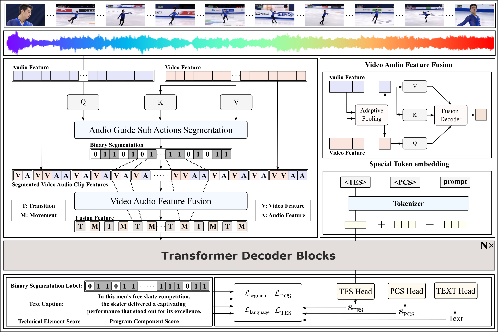

# **From Beats to Scores: A Multi-Modal Framework for Comprehensive Figure Skating Assessment**

## Overview of our method

We begin by identifying sub-actions using the audio guide and constructing a series of multi-modal features. Next, we fuse the corresponding video and audio feature clips to generate fusion tokens. The input series is then concatenated with special tokens and a text prompt. After performing context representation learning, we are able to regress scores and generate evaluation texts.

## Code Overview

- agl.py: sub-action localization module
- mllm.py: video audio fusion and transformer decoder
- decoder.py: implementation of attention and so on
- tokenizer.py: simple tokenizer
- config/config.yaml: parameter of the model and dataset
- generate_captions/gen.py: generate the textual caption
- trainn.py: training code

## Reproduce on FineFS Dataset

### Feature Extraction

We adopt [video_feature](https://github.com/v-iashin/video_features) to extract i3d video and vggish audio feature.

### Caption Generation

The textual caption is generated with the gen.py.

**The feature we extracted and reconstructed annotation will be released soon.**

### Training and Evaluation

Modify the dataset path in the config.yaml first and run `python trainn.py`
